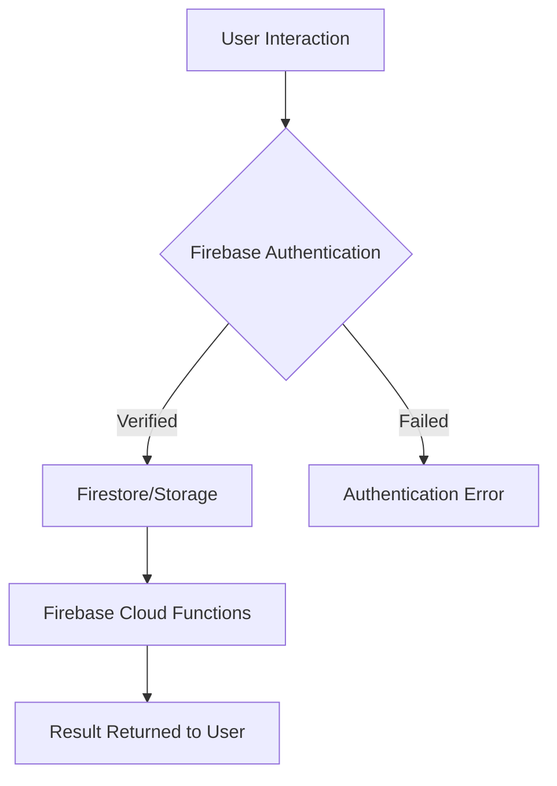

# Design Document
## User Story
### As a subtenant
- I want to be able to view more details/pictures about a property by tapping on it's card on the Rent page (more details: date posted, etc.).
- I want to be able to filter by price, roommate count, amenities include (water, electricity, Wi-Fi), distance from school.
- I want to be able to view a Zillow-like map of clickable posted properties.
- I want to chat with potential subletters.
- I want to favorite/unfavorite listings on the RentPage and view my favorited listings in a favorited listings page.

### As a subletter
- I want to be able to post listings quickly, upload pictures and fill in the necessary details.
- I want to be able to view the status of posted listings (e.g. number of times viewed, number of people interested).
- I want to be able to edit or delete my listing information (e.g. change the rent or add a description).
- I want to receive instant notifications when someone is interested in my listings so that I can respond quickly to potential subleasers.

### As a user
- I want manuals or tutorials of how to use the app.
- I want to be able to edit various details about my profile, such as my password, profile picture, and class info.

## Functionality Definition

### Home Browsing & Searching
- Inputs: filter criteria (location, price range, room type, lease term, etc.).
- Function Requirement:
    - Support condition filtering and real-time search.
    - Slide to select (Tinder style).
    - Listing detail page to show pictures and details.
- Output: List or detail page of matched properties.

### Housing Posting
- Inputs: housing information (rent, location, pictures, description, contact information).
- Functional Requirements:
	- Data entry validation (e.g. required fields, image format).
	- Data upload to Firebase.
    - Listing information needs to be stored in the database and associated with the user account.
- Output: Confirmation of successful listing.

### Instant Messaging
- Input: the content of the message sent by the user.
- Function Requirement:
	- Real-time message updates (Firebase Realtime Database/Firestore).
	- Message read/unread status flagging.
- Output: Message status update and storage.

### User Accounts Management
- Input: registration/login information (email, password).
- Function Requirement:
	- Firebase Authentication supports multiple login methods.
	- Encrypted storage of user information (e.g. Firestore).
	- Provide “Forgot Password” function.
- Output: Feedback on successful login or operation.

## Technical Architecture

### Overall Architecture
- Front-end: React Native, using Expo to manage the development environment.
- Backend: Firebase (Authentication, Firestore, Storage).
- Database: Firestore, storing users, listings, chat logs and other information.
- Other services: Firebase Cloud Messaging (push notifications).

### Data Flow
1. The user requests data or sends an operation command.
2. Firebase Authentication verifies the identity.
3. Firestore/Storage reads or writes data.
4. The data is processed by Firebase Cloud Functions for back-end logic (e.g. notification push, data filtering).
5. Return the result of the operation to the user.

###  Technology Stack
- Development framework: React Native (Expo).
- Database: Firestore.
- Cloud Storage: Firebase Storage.
- Authentication Service: Firebase Authentication.
- Push Messaging: Firebase Cloud Messaging.

## Database Structure
### Database Overview
- Type: Firestore (NoSQL database)
- Core collection:
	- users: stores user information
	- properties: stores information about listings
	- messages: stores chats between users

### Data Structure Definitions
#### User Collection
| Field       | Type       | Description                              |
|--------------|------------|-----------------------------------|
| `email`      | String     | user email                          |
| `first`       | String     | usesr first name                            |
| `last`     | String     | user last name                     |
| `interested_listing_ids`| List     | List consisting of rentals of interest                        |
| `listing_ids`       | List     | List consisting of self-polished rentals |
| `join_date`  | Timestamp  | Account Creation Date                      |

#### House Collection
| Field       | Type       | Description                              |
|--------------|------------|-----------------------------------|
| `address`      | String     | house address                          |
| `area`       | Number     | floor area of the house                           |
| `bathrooms`     | Number     | num of bathrooms                     |
| `bedrooms`| Number     | num of bedrooms                        |
| `image_url`       | String     | house image URL |
| `owner_id`  | String  | id of house owner                    |

#### Message Collection
| Field       | Type       | Description                              |
|--------------|------------|-----------------------------------|
| `message_text`      | String     | content of the message                          |
| `message_timestamp`       | Timestamp     | Timestamp for message generation                       |
| `receiver_id`     | String     |                   |
| `sender_id`| String     |                     |

### Data Relationships
####  Users and listings:
- A user (users) can have multiple listings (houses).
- A user can have multiple listings (houses). The listings and publishers are associated with each other by ownerId.

#### Users and Messages:
- Users can chat with each other through the messages collection.

## API Specification
- Access: Direct manipulation of database collections and documents through the Firebase SDK (e.g. firebase/firestore).
- Operation type:
	- Creating a document: Use the addDoc or setDoc method.
	- Update a document: Use the updateDoc method.
	- Deleting a document: use the deleteDoc method.
	- Querying a document: Use the getDoc, getDocs, or Firestore query builder.

 ## Decision Records
 ### Phase 1: Technology Selection
 We Chose React Native to achieve cross-platform compatibility, enabling simultaneous development for iOS and Android while saving development time and costs.

 We Adopted Firebase for its serverless architecture advantages, including real-time database, user authentication, cloud storage, and notification services, reducing infrastructure management overhead.

 ### Phase 2: MVP Design
 We started by completing the most basic functionality of the design.
 1.	Property Posting:
 2.	Property Browsing:

We also reserve interfaces for future features such as map display (Google Maps API) and online chat (Firebase Chat).

### Phase 3: Final Feature Completion
 After the core features are launched, we optimize the user experience and implement the final functionalities to enhance product competitiveness.
 - Data Query: Use Firebase Firestore’s advanced query capabilities to optimize filtering and sorting.
 - UI/UX: Apply modern design principles (e.g., Material Design) to improve layout, button interactions, and loading animations.

## External Resources
1.	Technical Documentation and Official Resources
	- React Native Official Docs
	- Expo Official Docs: Expo Docs
 	- Google Maps Platform

2.	Code Editors and Plugins
	- Cursor + ChatGPT: For code completion, issue debugging, and auto-documentation.
 	- Project Management: Github Kanban Board
  	- Maestro: E2E testing tool

3.	Other online Courses from [Youtube](https://www.youtube.com/watch?v=AHIGrwuX18k)

## Difficulties and Solutions

1.	How to implement photo uploading for properties? And provide both photo and local selection?
	- After reading the official react manual, we used the expo-image-picker library to handle image selection and picture taking, first obtaining access to the media library and camera permissions, then launching the image selection function, and finally uploading the image into a Blob format for permanent storage in FIrebase, with user-friendly error handling and hints.

## Evaluation

We conducted **End-to-End (E2E) testing** using **Maestro** to ensure the core features of our MVP (**v1.0.0**) functioned as expected. This process simulated real user interactions and validated essential workflows.

### **Tested Features:**  
- User registration and login.  
- Browsing available properties.  
- Posting property listings with details like title, description, price, and image.

### **Results:**  
- All tested features worked as intended, ensuring a stable and functional MVP.  
- Future improvements to the testing script will include filtering, saving, chat functionality, and managing property listings.

### **Watch the Test in Action!**  
Check out our automated E2E testing process:  

